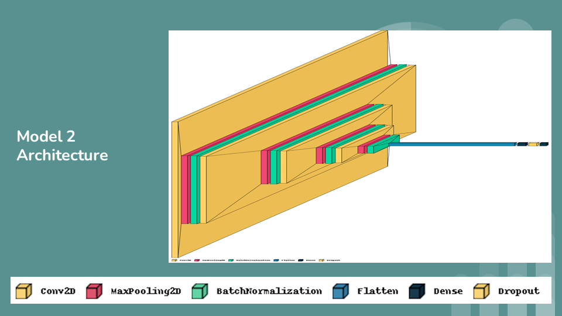

# Five-class classification of heart sound signals using the short-term Fourier transform features

This repository contains the implementation of a Convolutional Neural Network (CNN) model for the classification of heart sound signals into five categories using short-term Fourier transform (STFT) features. The project aims to enhance the efficiency and accuracy of diagnosing cardiovascular diseases by leveraging machine learning techniques on phonocardiogram (PCG) signals obtained from electronic stethoscopes.

## Table of Contents

- [Motivation](#motivation)
- [About STFT](#about-stft)
- [Tech Stack Used](#tech-stack-used)
- [Setup Instructions](#setup-instructions)
- [Model Architecture](#model-architecture)
- [Observations](#observations)
- [Conclusion](#conclusion)
- [Credits](#credits)

## Motivation

Cardiovascular diseases (CVDs) are a leading cause of mortality worldwide, necessitating early and accurate diagnosis for improved patient outcomes. Traditional cardiac auscultation, while effective, is subjective and prone to human error. Leveraging machine learning on digital heart sound signals offers objective analysis and early detection capabilities, revolutionizing cardiac diagnostics.

## About STFT

Short-term Fourier transform (STFT) is a signal processing technique used to analyze variations in frequency content over short time intervals. By converting heart sound signals into STFT features, the model can capture temporal and frequency characteristics crucial for distinguishing between normal and abnormal heart conditions.

## Tech Stack Used

- Python
- Jupyter Notebook
- Librosa (audio processing)
- TensorFlow/Keras (deep learning)
- Scikit-learn (machine learning)
- VisualKeras (visualization)

## Setup Instructions

- Clone this repository.
- Open the provided Jupyter Notebook `heart_sound_classification.ipynb`.
- Ensure all necessary libraries are installed.
- Run the codes.

## Model Architecture

### Model 1:

- Three Convolutional layers with ReLU activation
- Two MaxPooling layers for spatial dimension reduction
- Flatten layer for converting 2D feature maps to 1D
- Two Fully Connected layers for classification
- Softmax activation for outputting class probabilities

### Model 2:

- Four Convolutional layers with ReLU activation and Batch Normalization
- Four MaxPooling layers for spatial dimension reduction
- Dropout layer for preventing overfitting
- Two Fully Connected layers for classification with softmax activation

## Observations

The models were trained and evaluated using two datasets (500 files and 1000 files respectively), achieving high accuracy scores:

#### First Dataset (500 files):

- Model 1: 100% accuracy
- Model 2: 70.99% accuracy
- Random Forest Classifier (RFC): 100% accuracy
- Extra Trees Classifier (ETC): 100% accuracy
- PCA (n=1): 36.1% accuracy

#### Second Dataset (1000 files):

- Model 1: 98.5% accuracy
- Model 2: 83.49% accuracy
- Random Forest Classifier (RFC): 91.0% accuracy
- Extra Trees Classifier (ETC): 94.5% accuracy
- PCA (n=1): 22.1% accuracy

## Conclusion

The utilization of STFT features combined with machine learning models shows promising results in classifying heart sound signals. This approach offers potential in early detection and accurate diagnosis of cardiovascular diseases, contributing to improved patient care and clinical workflow optimization.

## Credits

- Kanhaiya Agarwal
- Yash Agarwal
- Suzen Akhtar
- Khair Alanam

For more details, refer to the below resources:

- [First Dataset (500 files)](https://github.com/yaseen21khan/Classification-of-Heart-Sound-Signal-Using-Multiple-Features)
-
- [EDA-Audio Classification Project Using Deep Learning](https://www.youtube.com/watch?v=mHPpCXqQd7Y&t=207s)
